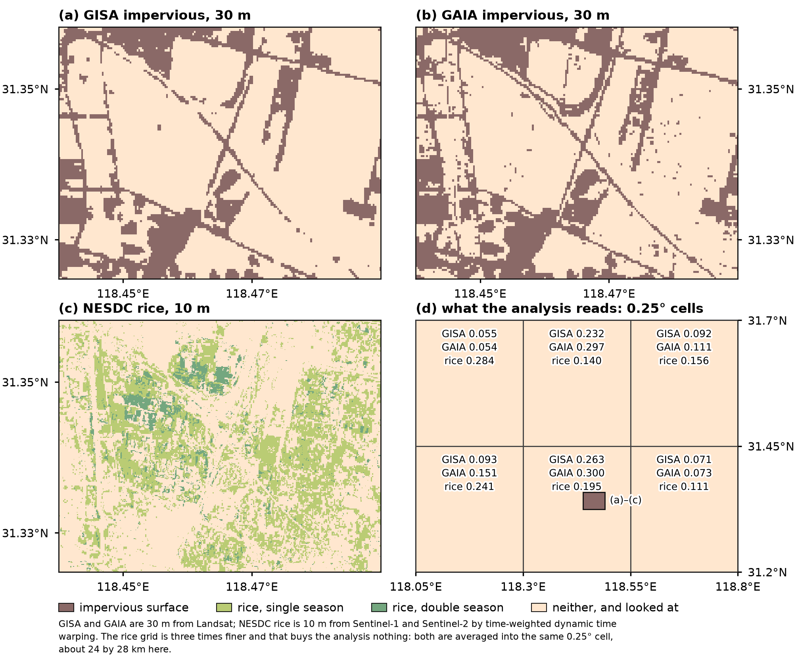
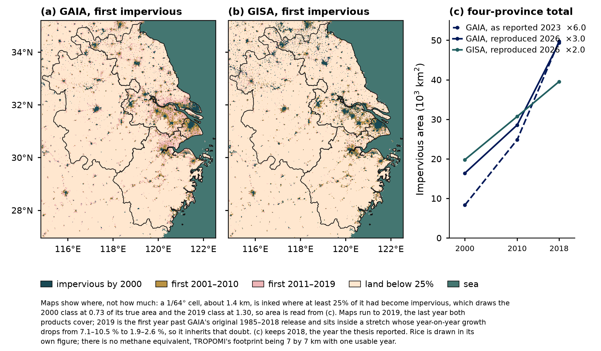
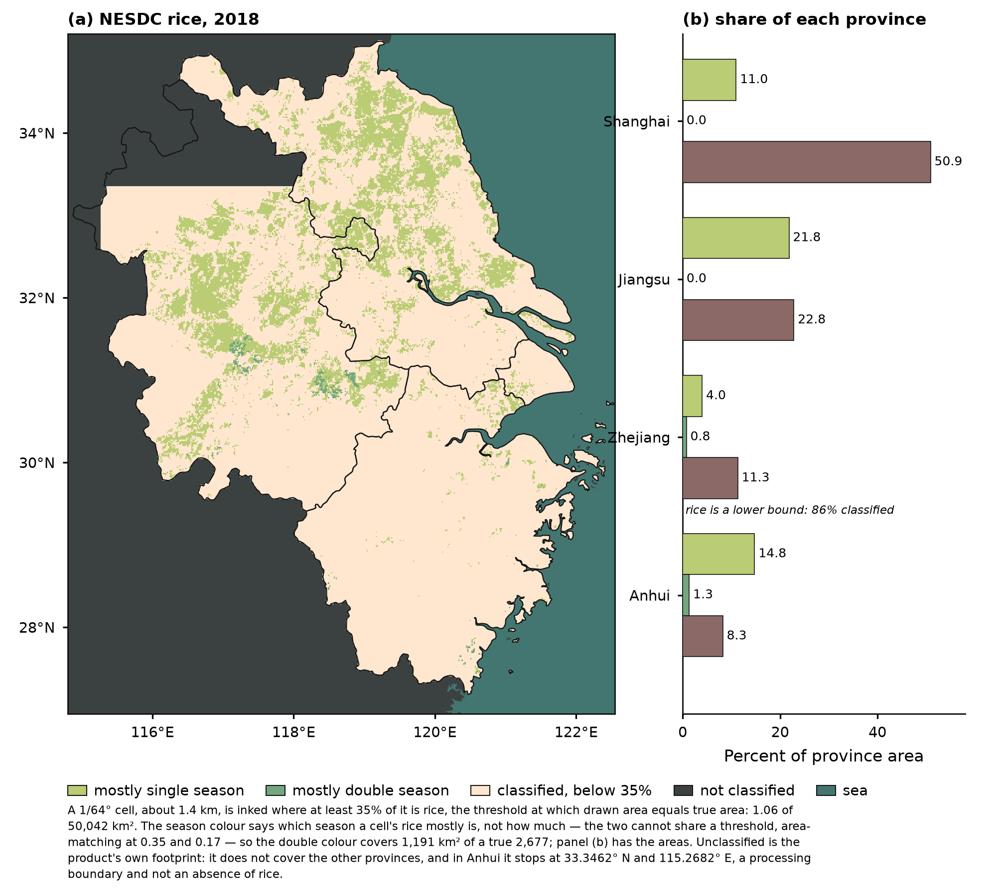
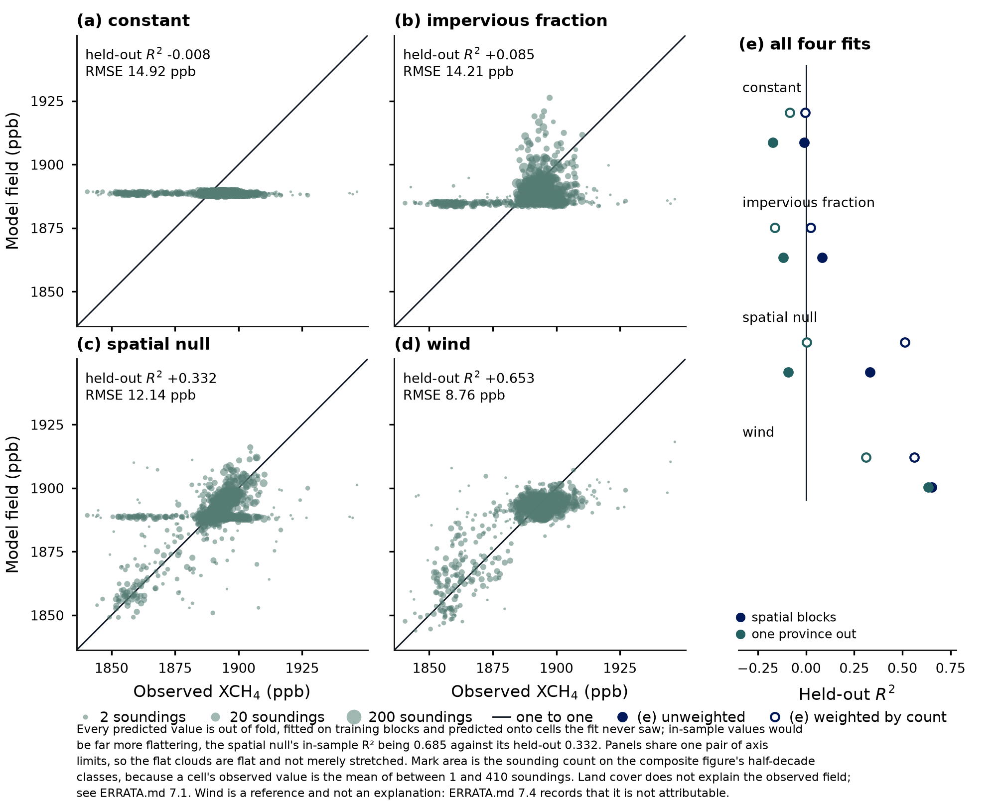
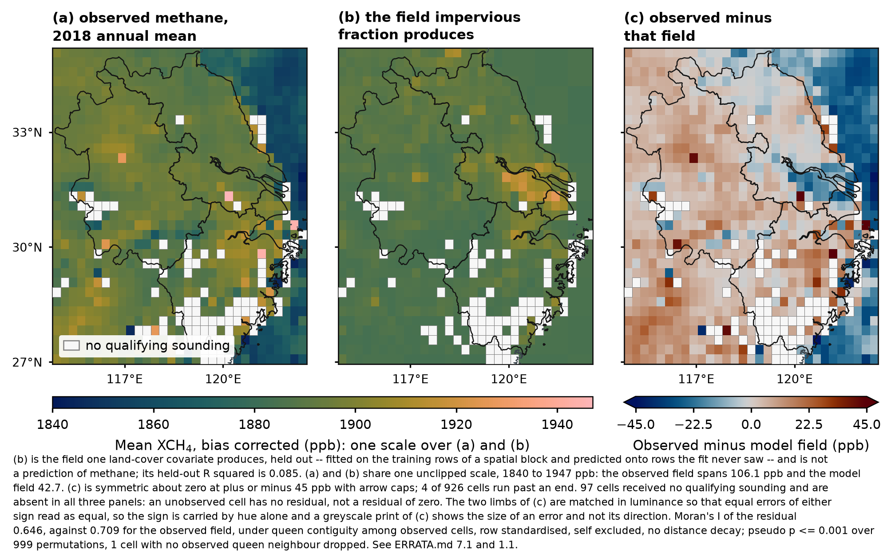
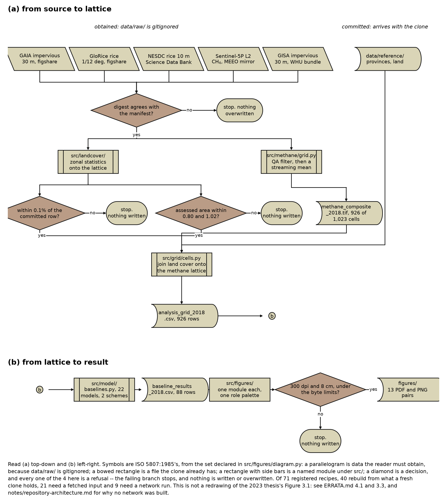
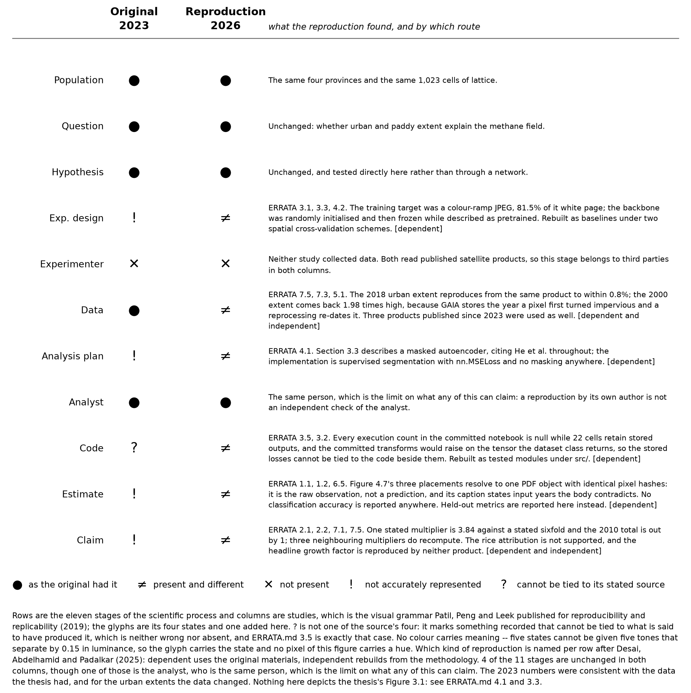

# Figure captions

Self-contained captions for the figures in this directory, in the form the
README uses. Each is written to be read without the surrounding text.

Figures are generated, not drawn by hand. Each is produced by a module under
`src/figures/` and written through the verified export path in
`src/figures/output.py`, which refuses to write anything below 300 dpi or
narrower than 8 cm. Regenerate with the script named under each caption.

---

### Coverage saturation and monthly yield, 2018

**Coverage of the analysis grid is a union statistic, so it saturates with the
number of granules that return data, and a small sample measures its own size
rather than the year's coverage.** Thirty-six productive granules reach 71.5
percent of the 1,023 cells and the remaining 187 add only 19.1 points to finish
at 90.52<!--#composite.coverage_percent--> percent. Soundings also arrive unevenly through the year, and the
unevenness runs opposite to the growing season: October alone carries 30.82
percent of the year's 110,920<!--#composite.soundings--> in-box soundings, while June, July and August
together carry 14.51 percent from three times as many granules.

Panel (a) is the cumulative count of grid cells that have received at least one
qualifying sounding, against productive granules in the order the streaming
loop handled them. Of 578<!--#composite.granules_gridded--> granules acquired over the box, 223<!--#composite.granules_with_data--> returned a
qualifying sounding and 355 returned none; a granule that returned none cannot
have covered a cell, so it is not a point on the axis. The curve is one
ordering of those 223 rather than an expected saturation curve, since a
different order reaches the same endpoint by a different path. The marked
sample size is the granule count of the 2018 reconnaissance, which reported
56.11 percent coverage; that figure is not a point on this curve, because those
thirty-six granules were drawn one per alternate month across seven years and
only six of them fall in 2018. Panels (b) and (c) share a month axis and are
stacked rather than drawn on twin axes, so neither series can be made to look
larger than the other by a choice of limits. January through March are shaded
because the reprocessed 2018 stream begins on 30 April; no granule was acquired
over the box in those months, which is a different fact from a month that was
sampled and yielded nothing. April is a single granule and 273 soundings,
labelled because at this scale its bar is otherwise indistinguishable from the
shaded absence beside it. Per-granule yield runs from 148 soundings in July to
1,103 in October, a factor of 7.4, and the July minimum coincides with both the
monsoon cloud cover that defeats the retrieval and the flooded-paddy season the
study is about. Coverage is computed on the 0.25 degree grid of 33 by 31 cells;
qualifying soundings are those with `qa_value` at or above 0.75.

Regenerate with `python scripts/make_coverage_figure.py`.

---

### Study area and analysis grid

**The four provinces of the Yangtze River Delta region, on the terrain that
explains where the methane composite has no data.** The analysis grid is 33
rows by 31 columns, 1,023<!--#composite.total_cells--> cells at 0.25 degrees,
spanning 114.8 to 122.55 east and 26.95 to 35.2 north. Those are the bounds the
cells actually occupy, not the declared box of 114.8 to 122.6 and 27.0 to 35.2:
the cell count rounds down in longitude and up in latitude, so the grid stops
0.05 degrees short of the declared east edge and runs 0.05 degrees past the
declared south edge.

The main panel is shaded relief from Copernicus DEM GLO-90 at 90 m, drawn over
all land in the frame and then veiled outside the four study provinces and
tinted inside them, so the study region is separated by tone as well as by its
heavier boundary and survives a print with no colour. The five provinces that
share the frame are named in italic; each is every admin-1 unit intersecting
the drawn extent, not a chosen list. Marked places are the four provincial
capitals, selected as Natural Earth's admin-1 capitals of the four study
provinces at scale rank 4 or better, which is the narrowest rule that returns
all four: Shanghai is rank 0, Nanjing and Hangzhou rank 2 and Hefei rank 4, and
a bare threshold reaching Hefei also reaches fourteen other places in the box.
Shanghai's name serves both the municipality and the city: at 8 pt the word
occupies 0.99 by 0.21 degrees here and no position inside the municipality's
polygon fits it, while the other three provinces each hold their name easily. The analysis lattice is **not** drawn
across the main panel, where 66 lines would be texture rather than reference and
where the composite figure already shows the resolution by drawing the cells as
the data; the detail box instead shows six cells over the Yangtze mouth at 4.6
times the main panel's scale, and the same six are outlined on the map at their
drawn size. One cell is 24 by 28 km at 31.7 north. The locator sits outside the
map frame rather than over Zhejiang's coast, and draws Natural Earth's admin-0
land boundary lines unfiltered, with no country named, filled or excluded; six
of the 59 lines in its extent are classed "Disputed (please verify)" by Natural
Earth itself, which also ships 33 per-country viewpoint fields, and this
repository takes no position on any of them. A formal disclaimer belongs in
this caption and not as a figure element, and the wording to use is the one
Elsevier asks for across its journals: **map lines delineate study areas and do
not necessarily depict accepted national boundaries.** That is adopted here as a
convention rather than as a venue requirement — it appears in the author guides
of several Elsevier remote-sensing journals, and *Remote Sensing of
Environment*'s own guide could not be read to confirm it, which
`notes/references.md` records. It codifies a decision already made carefully
rather than changing anything drawn, and it costs one sentence regardless of
where the figure is submitted.

The terrain is the finding, thin as a reference map's finding must be. The 97<!--#composite.uncovered_cells-->
cells of the lattice that received no qualifying sounding in 2018 are not
scattered evenly over it: 74<!--#composite.absent_on_land--> of them lie wholly
on land, and their median elevation is 502<!--#composite.absent_median_elevation-->
m against 35<!--#composite.covered_median_elevation--> m for the 926<!--#composite.covered_cells-->
cells that were observed. 50<!--#composite.absent_above_500m--> of the 97 sit
above 500 m, against 24<!--#composite.covered_above_500m--> of the 926. The
largest connected group, 47<!--#composite.largest_absent_block--> cells of the
19<!--#composite.absent_components--> the absent cells form, covers the
mountains along the southern edge of the box, 35 of its 47 cells falling mostly
in Zhejiang and 11 in Fujian, at a median 552 m and reaching 1,119 m. That block
is the darkest terrain in this panel, and it is the hole in the middle of the
composite figure's southern edge. Which cells those are is the composite
figure's subject and is deliberately not drawn here.

Boundaries, coastline, populated places and the inset relief are Natural Earth
and are public domain; the province and land layers are 10 m and the inset
boundaries 50 m. Shanghai's outline is the one caveat worth naming at this size:
Natural Earth resolves the municipality with 213 vertices across four parts
where GADM 4.1 uses 1,925 across 112, and at 1.5 cm of drawn width the
difference is not visible, appearing as straight segments along the coast only
above roughly three times magnification. Shaded relief is derived data and its
licence requires the notice carried on the figure: produced using Copernicus
WorldDEM™-90 © DLR e.V. 2010–2014 and © Airbus Defence and Space GmbH 2014–2018
provided under COPERNICUS by the European Union and ESA; all rights reserved.
The organisations in charge of the Copernicus programme by law or by delegation
do not incur any liability for any use of the Copernicus WorldDEM™-90. The main
map is equirectangular with its standard parallel at 31.075 north, the centre of
the study area, so a degree of longitude is drawn 0.857 times as long as a
degree of latitude and the analysis cells stay rectangular; scale is exact only
at that parallel, running 3.9 percent small at the southern edge and 4.8 percent
large at the northern, and area is not preserved. Nothing in this study is
measured from a map, since areas are computed analytically on the authalic
sphere, so the projection is a display choice throughout. The locator is drawn
in the China Albers equal-area conic, which is why the study box appears rotated
in it.

Regenerate with `python scripts/make_study_area_figure.py`. The relief and place
layers it reads are built once by `python scripts/build_map_reference.py --write`
from tiles fetched by `python scripts/fetch_copernicus_dem.py --download`.

---

### The 2018 methane composite

**The methane field is smooth at the scale of the analysis lattice, and 9.5<!--#composite.uncovered_percent-->
percent of the lattice is not observed at all.** Cell means run from 1,840 to
1,947 ppb, but the middle 96 percent of them span only 59 ppb, and neighbouring
cells rarely differ by more than a few. The unobserved part is not scattered
noise: 97<!--#composite.uncovered_cells--> of the 1,023<!--#composite.total_cells--> cells
carry no qualifying sounding, and they fall into 19<!--#composite.absent_components-->
connected groups of which the largest holds 47<!--#composite.largest_absent_block-->
cells over mountainous southern Zhejiang. Where the field is observed it rests
on very unequal evidence, from 1<!--#composite.min_soundings--> sounding to
410<!--#composite.max_soundings--> with a median of 74<!--#composite.median_soundings-->.

Panel (a) is the mean of the bias-corrected retrieval, which is the
operationally corrected product and the variable the reproduction's analysis
used throughout; it is not interchangeable with the raw retrieval, since the
correction averages +11.64<!--#composite.bias_mean--> ppb and varies across
cells by more than the field's own standard deviation. The correction does not
remove the field's dependence on surface albedo, which is 199.7<!--#albedo.slope_corrected-->
ppb per unit albedo after correction against 203.9<!--#albedo.slope_raw--> before.
The scale is clipped to the middle 96 percent of cell means, with the arrow caps
marking values beyond it; the excluded tails sit in the least-sampled cells,
whose median count is 2 soundings at the high end and 12 at the low against
74 overall, so they are thin sampling rather than methane. Panel (b) is the
number of qualifying soundings each cell mean rests on, classed in half-decade
steps rather than shaded continuously, because a linear scale would render
every sparse cell alike and the sparse cells are where the sampling structure
is. Both panels share one frame and one lattice of 33 by 31 cells at 0.25
degrees, so a cell in one is the same cell in the other. Coverage is
90.52<!--#composite.coverage_percent--> percent of the lattice over
110,920<!--#composite.soundings--> in-box soundings; qualifying means a
`qa_value` at or above 0.75. Boundaries and coastline are Natural Earth.

Regenerate with `python scripts/make_composite_figure.py`.
---

### Land cover at the resolution it was measured

**Every other land-cover figure in this repository shows a fraction per
0.25 degree cell; this is what the fractions are made of.** The window is 5.7
by 3.7 km on the eastern edge of Wuhu, in Anhui, at 118.44 to 118.49 east and
31.3248 to 31.3582 north. Panels (a) and (b) draw impervious surface at 30 m,
186<!--#window.impervious_columns--> pixels across, from GISA and from GAIA;
panel (c) draws the NESDC rice classification at 10 m,
557<!--#window.rice_columns--> pixels across. Each panel gives at least one
drawn pixel to every source pixel, 4.4 for the 30 m products and 1.5 for the
10 m one, so nothing here has been resampled into a smoother picture of itself.

Panel (d) is the same ground as the analysis reads it: three by two cells of
0.25 degrees, about 24 by 28 km each, with the impervious fraction from both
products and the combined rice fraction written in each. The window of panels
(a) to (c) is the small rectangle in the lower middle cell. All six cells have
complete coverage from both products, so none of the numbers rests on a partial
raster.

**The window is not a representative sample and is not offered as one.** It is
34.2 percent rice against 19.5<!--#window.cell_rice_combined_percent--> percent for the
cell that contains it, and 23.9<!--#window.impervious_gisa_percent--> percent
impervious against 26.3<!--#window.cell_impervious_gisa_percent-->. It is a place to
see the resolution.

What the aggregation discards is visible by comparing the panels: the
interdigitation of paddy blocks and built land at a few hundred metres, which
is the scale at which this landscape is organised, becomes one number per
24 by 28 km cell. Of the window, 29.4<!--#window.rice_single_percent--> percent
is single-season rice and 4.9<!--#window.rice_double_percent--> percent is
double-season; the second class exists in only two of the four study provinces,
Anhui and Zhejiang, and Jiangsu and Shanghai have none of it, so the window was
chosen in Anhui in order to show a distinction the study region really carries.
Because the window lies wholly inside Anhui, every 0 in the rice raster here is
real non-rice land; the product declares no nodata and 0 elsewhere also means
out-of-province background, which is why that containment was tested rather
than assumed.

**The two impervious products are not interchangeable at pixel scale either.**
GISA calls 23.9<!--#window.impervious_gisa_percent--> percent of this window
impervious and GAIA calls 29.7<!--#window.impervious_gaia_percent--> percent,
a ratio of 0.81, which is close to the ratio of 0.80 they reach over the four
provinces as a whole.

A caution about resolution that the panels invite and the analysis does not
support: the rice grid is three times finer than the impervious one, and that
buys nothing here. GISA and GAIA are 30 m products derived from Landsat; the
NESDC classification is 10 m, derived from Sentinel-1 and Sentinel-2 by a
time-weighted dynamic time warping method. They are different kinds of product
with different error structures, and both are averaged into the same 0.25
degree cell before anything is fitted. Extent is selected by
`src.landcover.selectors`, `1 <= value <= 36` for GISA and `value >= 5` for
GAIA, which are the two products' opposite year-of-change conventions.

Regenerate with `python scripts/make_landcover_figure.py`. The window clips it
reads are cut once by `python scripts/clip_landcover_window.py --write`.

---

### Urban expansion, 2000 to 2019, from two products

**Urban extent in these four provinces grew several-fold between 2000 and 2018,
and the three available accounts of it disagree about the growth factor by a
factor of three.** This is the reproduction's one positive quantitative
land-cover finding.

Panel (c) separates the **source** from the **computation**, because there are
two sources and not three. GAIA and GISA are datasets; the 2023 thesis is a
prior study whose impervious figures came from GAIA, so the colour names the
product and the dash names the computation. GAIA as reported in 2023 gives
8,297<!--#urban.thesis_2000--> km2 in 2000 and
49,725<!--#urban.thesis_2018--> km2 in 2018, a factor of
6.0<!--#urban.thesis_factor-->. GAIA recomputed here in 2026 gives
16,387<!--#urban.gaia_2000--> and 49,348<!--#urban.gaia_2018-->, a factor of
3.0<!--#urban.gaia_factor-->. GISA recomputed gives
19,787<!--#urban.gisa_2000--> and 39,532<!--#urban.gisa_2018-->, a factor of
2.0<!--#urban.gisa_factor-->.

That layout makes the sharper comparison visible. **The same product recomputed
holds 2018 to within 0.8 percent and moves 2000 by a factor of two.** A
year-of-change product stores the year each pixel first became impervious, so a
reprocessing with more training years and better cloud handling redates earlier
transitions, and the effect is largest in the earliest years where observations
are sparsest. The disagreement is a property of the product's release history
and not an error in either computation.

The two products also cross over. GISA's 2018 total is
0.80<!--#urban.gisa_over_gaia_2018--> of GAIA's, a difference of about a fifth
in the direction opposite to what the global validation predicts, since GAIA is
the product reported to omit impervious surface. But GISA is the **larger** of
the two in 2000, so the products disagree about the history rather than about
the extent.

Panels (a) and (b) show where the growth is, in three nested classes by the year
a pixel first became impervious. They run to 2019 and not to 2018 because 2019
is the last year both products cover: GISA's pixel values stop at 37, which
decodes to 2019, so a map going further would drop GISA and lose the
disagreement. GAIA reaches 50,348<!--#urban.gaia_2019--> km2 in 2019 and GISA
40,452<!--#urban.gisa_2019-->. **2019 carries a caveat**: it is the first year
past GAIA's original 1985 to 2018 release, and it sits inside a stretch whose
year-on-year growth of the four-province total drops from 7.1 to 10.5 percent
across 2011 to 2016 to between 1.9 and 2.6 percent from 2017 onward. Panel (c)
keeps 2018, which is the year the thesis reported and the only year a
comparison against it can be made.

**Area must not be read from the maps.** A cell is inked where at least a
quarter of it had become impervious by that date, drawn at 1/64 degree, about
1.4 km, from an aggregate at 1/128. That threshold does not preserve area and
does not fail evenly: urban land in 2000 is more dispersed than in 2019, so the
drawn 2000 class is 0.73 of its true area while the drawn 2019 class is 1.30,
which flatters growth by about four fifths. Panel (c) carries the magnitudes and
the maps carry the pattern.

Totals are for the four provinces on the Natural Earth boundaries and come from
`data/processed/urban_extent_totals.csv`, whose twenty overlapping rows
reproduce the two older provincial tables to 1.3e-05; that agreement is the
check that the two products' opposite year conventions were both applied the
right way round. GAIA counts down from 2023, so 2019 is `value >= 4`; GISA
counts up from 1972, so 2019 is `1 <= value <= 37`. Inverting GISA's would
select only what was built in the last two years, 9,468,801 pixels against
202,830,997, and would still draw a plausible map.

Rice is drawn in its own figure. There is no methane equivalent and that is
where a reader will most expect one: TROPOMI's footprint is 7 by 7 km at nadir,
the analysis grid is 0.25 degrees because coverage forced it there, and the 2018
composite leaves 97<!--#composite.uncovered_cells--> of its
1,023<!--#composite.total_cells--> cells with no qualifying sounding at all,
with per-cell counts running from 1<!--#composite.min_soundings--> to
410<!--#composite.max_soundings-->. There is one year of usable methane, not
three, and a fine-resolution methane field from this data would be interpolation
presented as observation.

Regenerate with `python scripts/make_urban_change_figure.py`. The aggregate and
the totals are built once by `python scripts/compute_urban_extent.py --write`.

---

### Paddy rice across the four provinces, 2018

**Rice is the study's subject and this is where it is, in the year the methane
composite covers.** Panel (a) draws the NESDC classification on a 1/64 degree
cell, about 1.4 km. Panel (b) puts rice beside the impervious surface it
competes with, as a share of each province's own area.

The map's threshold is chosen by a rule rather than by eye: a cell is inked
where at least 35 percent of it is rice, which is the value at which the drawn
area equals the true area. Measured, the inked total is 1.06 of the
50,042<!--#rice.total_km2--> km2 the provincial totals record, against 0.73 to
1.31 for the urban figure at its own threshold. Rice can be drawn area-honestly
and impervious surface cannot, because this map draws one quantity where that
one draws three.

**The season colour says which season a cell's rice mostly is, not how much.**
The two cannot share a threshold: single-season rice area-matches at 0.35 and
double-season at 0.17, because double-season paddy is 5.3 percent of the rice
and interleaved with single rather than segregated. So one threshold decides
whether a cell is rice and the colour reports the majority season, at the cost
that the double-season colour covers 1,191 km2 of a true
2,677<!--#rice.double_km2-->. Panel (b) carries the areas.

That distinction is a real property of the region and not a nuance. Only two of
the four provinces grow double-season rice at all:
1,890<!--#rice.double_anhui_km2--> km2 in Anhui and
788<!--#rice.double_zhejiang_km2--> km2 in Zhejiang, against none in Jiangsu
and none in Shanghai.

**Unclassified is drawn, because absence here has two meanings.** The NESDC
rasters declare no nodata and their 0 means both real non-rice land and ground
the product never covered, so the map separates the two. The dark class is
land the classification does not reach: the other provinces, which the product
does not cover at all, and the part of Anhui north of 33.3462 north and west of
115.2682 east. That northern boundary is a processing artefact and not an
absence of rice — five annual products across three raster extents all
terminate classification within 22 m of the same latitude, and GloRice puts
about 320 km2 of rice in the region — so drawing it as ordinary non-rice land
would have said northern Anhui grows none. Each of the four rasters is masked
by the province it is named for and never by their union, because the files'
boxes overlap and a union mask assesses shared ground once per file; the
committed totals record the assessed area at 0.861<!--#rice.anhui_coverage-->
of the Anhui polygon and within 0.2 percent of the polygon for the other three.

Anhui's rice bars in panel (b) are therefore a lower bound, and are marked as
one: the denominator throughout the panel is the province polygon, so that
three bars in one group can be compared, and Anhui's rice is measured over the
86 percent of it the product classified. The comparison the panel is for is
this: Shanghai is 50.9<!--#urban.share_shanghai_percent--> percent impervious
and 11.0<!--#rice.share_shanghai_percent--> percent rice, while Jiangsu is
22.8<!--#urban.share_jiangsu_percent--> percent impervious and
21.8<!--#rice.share_jiangsu_percent--> percent rice. Impervious areas are
GAIA's, which is the product the analysis grid carries; GISA finds about a
fifth less in 2018 and the urban change figure draws that disagreement out.

Regenerate with `python scripts/make_landcover_regional_figure.py`. The rice
grid it reads is built once by `python scripts/compute_rice_extent.py --write`.
---

### Observed methane against the fields four models produce

**A land-cover model predicts close to the mean everywhere, so its cloud lies
flat; a model of smoothness tracks the diagonal. That contrast is the
reproduction's central result, and it is a shape rather than a number.** None
of these panels is a prediction of methane. Each shows the field a model
produces from its own predictors, drawn against what was observed, and the
figure is about the distance between them; `ERRATA.md` 7.1 records that land
cover does not explain the observed field and this is the demonstration of
that.

**Every figure in the four panels is held out by spatial blocks without
weighting**, which is one of four defensible scheme-weighting combinations and
the optimistic end of the bracket `notes/decisions.md` records; the summary
inset carries all four. Panel (a) is a constant, which has no information and
reaches held-out R squared -0.008<!--#baseline.constant_r2-->. Panel (b) is
impervious fraction, the thesis's own predictor, at
0.085<!--#baseline.impervious_r2--> and an RMSE of
14.21<!--#baseline.impervious_rmse--> ppb; its cloud is a thickened version
of the constant's rather than a rotated one. Panel (c) is the spatial null,
which predicts each cell from the mean of its eight neighbours and knows
nothing about the surface, at 0.332<!--#baseline.null_r2-->. Panel (d) is wind,
at 0.653<!--#baseline.wind_r2-->, and it is a reference and not an
explanation: `ERRATA.md` 7.4 records that the wind association is not
attributable, because each cell's annual mean is taken over whichever days it
was observed on and those differ across cells by up to 228 days.

The same finding in ranges. The observed field spans
106<!--#baseline.observed_span_ppb--> ppb across the 926 cells. The field
impervious fraction produces spans 43<!--#baseline.impervious_span_ppb-->, the
spatial null's spans 67<!--#baseline.null_span_ppb-->, and the constant's spans
1.4<!--#baseline.constant_span_ppb-->, which is five folds each predicting
their own training mean. Land cover sits nearer the constant than the
smoothness on every measure the figure carries.

**Every predicted value is out of fold**, fitted on training blocks and
predicted onto cells the fit never saw. That distinction is not decoration: the
spatial null's in-sample R squared is 0.685<!--#baseline.null_in_sample_r2-->
against its held-out 0.332<!--#baseline.null_r2-->, so a figure drawing fitted
values would have shown a smoothness bar twice the bar it is. All four panels
share one pair of axis limits, so a flat cloud is flat rather than stretched,
and mark area carries the sounding count on the composite figure's half-decade
classes, because a cell's observed value is the mean of between
1<!--#composite.min_soundings--> and 410<!--#composite.max_soundings-->
soundings.

The panels are one scheme and one weighting, spatial blocks and unweighted, and
panel (e) is there so that is not a hidden choice: it draws the held-out R
squared of all four models under both schemes and both weightings, with the
scheme in the colour and the weighting in the fill. Spatial blocks because it
is the only scheme in which the spatial null is a bar at all — under
leave-one-province-out a held-out province's interior has no training
neighbour, so the null falls to -0.091, which still beats the constant's -0.172
but is below zero and so explains none of the held-out variance.

All four models run on the 926<!--#composite.covered_cells--> cells that carry
a methane value. The rice models are absent because they run on 531 cells and
the table's own rule is that results on different samples must not be compared
without saying so; four panels side by side is a comparison whatever a caption
says. Their numbers, also under spatial blocks without weighting: rice alone
reaches
-0.031<!--#baseline.rice_alone_r2-->, impervious on that same sample reaches
0.018<!--#baseline.impervious_rice_sample_r2-->, and adding rice to impervious
moves it to 0.017<!--#baseline.rice_plus_impervious_r2-->, which is down rather
than up.

Regenerate with `python scripts/make_observed_predicted_figure.py`. The
held-out predictions it reads are built by
`python scripts/compute_baseline_predictions.py --write`, which refuses to
write unless the metrics recomputed from them reproduce
`data/processed/baseline_results_2018.csv`.

---

### The field a land-cover model produces, and what is left over

**The field a land-cover model produces is not the observed field, and the
difference is not noise: it has almost all of the observed field's spatial
structure still in it.** Panel (b) is not a prediction of methane. It is the
field one land-cover covariate produces, drawn beside the observation so the
distance between them can be read cell by cell; `ERRATA.md` 7.1 records that
land cover does not explain the observed methane field, and this figure is the
demonstration of that. `ERRATA.md` 1.1 records that the thesis's Figure 4.7,
captioned as this comparison, was the same embedded image as Figure 4.5(a), so
the comparison was never actually drawn.

Panels (a) and (b) share one colour scale,
1840<!--#residual.scale_low_ppb--> to 1947<!--#residual.scale_high_ppb--> ppb,
which is the observed field's own full range and is not clipped. Under it the
observed field spans 106<!--#baseline.observed_span_ppb--> ppb and the field
the model produces spans 43<!--#baseline.impervious_span_ppb-->, four tenths as
much, which is the same finding the scatter figure draws as a flat cloud. The
composite figure clips its value panel to the 2nd and 98th percentiles and this
one deliberately does not: there the job is to read one field well, here it is
to compare two spans, and clipping would cut the observed span shown by nearly
half while leaving the model field almost untouched.

Panel (c) is the residual, symmetric about zero at plus or minus
45<!--#residual.scale_limit_ppb--> ppb with arrow caps;
4<!--#residual.clipped_cells--> of the 926<!--#residual.observed_cells--> cells
run past an end, the residuals themselves running from
-48<!--#residual.residual_low_ppb--> to
60<!--#residual.residual_high_ppb--> ppb with a standard deviation of
14.2<!--#residual.residual_sd_ppb-->. The structure in it is the point:
Moran's I of the residual is
0.646<!--#residual.residual_moran-->, against
0.709<!--#residual.observed_moran--> for the observed field, so the fit removes
8.8<!--#residual.moran_removed_percent--> percent of the observed field's
spatial autocorrelation and leaves the rest. **The weights are queen contiguity
among observed cells on the 0.25 degree analysis lattice, row standardised,
self excluded, with no distance decay**, stated because `ERRATA.md` 6.2 records
that the thesis reported a Moran's I without saying what its weights were,
which makes a number of that kind unreproducible.
1<!--#residual.isolated_cells--> cell has no observed queen neighbour and is
dropped from the statistic rather than given a weight of zero; the pseudo p is
at its floor of 0.001 over 999<!--#residual.permutations--> permutations of the
residual over the same cells.

**Every value in panel (b) is out of fold**, fitted on the training rows of a
spatial block and predicted onto rows the fit never saw, from the same
committed predictions the observed-against-predicted figure draws, so the two
figures cannot be describing different fits. The model is impervious fraction
alone rather than impervious with rice: rice exists for only 531 of the
926<!--#residual.observed_cells--> cells, so a two-covariate field would be
blank over 395 more of them and this figure would carry two kinds of absence in
the same near-white, which is the one thing it cannot afford.

97<!--#residual.absent_cells--> cells received no qualifying sounding and are
absent in all three panels, drawn as this repository draws absence everywhere:
a near-white fill with a thin outline, so a single isolated cell reads as a
deliberate mark. In panel (c) that is a statement and not an inheritance —
**an unobserved cell has no residual, not a residual of zero**, and zero is the
most meaningful value on a diverging scale, so filling those cells with it
would draw the model's 97 best cells exactly where it has no cells at all. The
scale's centre is held 0.17 clear of the absence tone in luminance for the same
reason.

One property of the diverging scale is worth stating rather than leaving to be
discovered. Its two limbs are matched in luminance, so that errors of equal
size and opposite sign read as equally large, which means the sign is carried
by hue alone: a greyscale print of panel (c) shows how large each error is and
not which way it points. The alternative — limbs of unequal luminance — buys
the sign back by drawing equal errors as unequal, which is the worse figure.
Because hue is the only carrier left, the two limbs are checked against each
other under simulated protanopia, deuteranopia and tritanopia, and hold at
least 15 CIE76 units apart everywhere beyond a tenth of the scale.

Regenerate with `python scripts/make_residual_field_figure.py`. It reads the
same `data/processed/baseline_predictions_2018.csv` as the
observed-against-predicted figure.

---

### What the repository does, from source to result

**A pipeline diagram that leaves out where a system refuses describes a
different system.** Four of the 25<!--#pipeline.nodes--> boxes here are
decisions and all four are refusals: the failing branch stops, and nothing is
written or overwritten. The manifest will not replace a populated digest that
disagrees with a fetched file. The area scripts will not write a row that has
moved by more than a tenth of a percent from the committed one. The rice extent
script will not write when a province's assessed area falls outside 0.80 to
1.02 of its polygon. The exporter will not write a figure below 300 dpi or 8 cm
or above the venue's byte limits.

The second thing a naive pipeline diagram omits is **which inputs a reader must
obtain**. `data/raw/` is gitignored, so five of the six inputs at the top are
downloads over four platforms — 5<!--#pipeline.fetch_routes--> parallelograms,
ISO's symbol for data, against one bowed rectangle for the reference layers a
clone already has. The distinction is carried by shape rather than by fill, so
it costs no colour and survives a black and white print. Of the
71<!--#pipeline.recipes--> registered regeneration recipes,
40<!--#pipeline.recipes_committed--> rebuild their artefact from what a fresh
clone holds, 21<!--#pipeline.recipes_local--> need a fetched input and
9<!--#pipeline.recipes_network--> need a network run.

Panel (a) reads top-down and panel (b) left-right, joined by ISO's connector
symbol. Two panels rather than one, decided by rendering: as a single top-down
frame the chart is eleven rows and 23.4 cm tall at this width, which is the
whole usable height of a Copernicus page.

Symbols are ISO 5807:1985's, drawn from the
12<!--#pipeline.shapes_declared--> declared in `src/figures/diagram.py`, of
which this figure uses 7<!--#pipeline.shapes_drawn-->. That module is to shapes
what `src/figures/style.py` is to colour: a figure names a shape and gets the
one path it means, or it does not draw. The six design principles the layout
follows — a minimal agreed set of shapes, a top-down and left-right reading
order, one entry and one exit point per shape with the decision excepted,
labelled decision branches, and inputs shown where a step needs them — are
Chaudhuri's (2020), and `notes/references.md` records the provenance chain and
what in it could not be verified.

**The graph is declared as data and the drawing reads it**, which is what makes
those principles assertions rather than intentions. It also makes possible the
one check a diagram needs and no test suite otherwise provides: every box names
the repository paths it stands for — 30<!--#pipeline.paths_named--> of them —
and `tests/test_figures_framework_pipeline.py` opens each one, then goes
further and asserts the thresholds written in the diamonds against the code
that enforces them. A box naming a module that was renamed fails there rather
than sitting on the page.

**This is not a redrawing of the 2023 thesis's Figure 3.1.** That figure is a
DeepLabv3+ architecture, and `ERRATA.md` 4.1 records that Section 3.3 describes
a masked autoencoder while the implementation is supervised segmentation, while
3.3 records that the backbone was randomly initialised and then frozen. It
depicts an architecture that was neither described accurately nor implemented
as described. The reproduction built no network at all;
`notes/repository-architecture.md` records that decision and the baselines that
forced it.

Regenerate with `python scripts/make_framework_pipeline_figure.py`, which
refuses to write if any box names something the repository does not have.

---

### What the reproduction found about each part of the study

**`ERRATA.md` records twenty-eight findings across seven sections, and read
straight through it is a list.** A list of defects is the wrong shape for what
the reproduction established: most of the study is intact, four parts are not,
and the reasons differ in kind. This puts
15<!--#reproduction.errata_cited--> of those
28<!--#reproduction.errata_sections--> sections, drawn from all
7<!--#reproduction.errata_chapters--> of them, in one frame.

The grammar is not this repository's. Rows are the
11<!--#reproduction.stages--> stages of the scientific process and columns are
studies, which is the visual tool Patil, Peng and Leek published for
reproducibility and replicability (2019, `10.1038/s41562-019-0629-z`). Because
that paper is paywalled, the stage names, their order and the states were taken
from the authors' own reference implementation, the `scifigure` package on
CRAN. `src/figures/diagram.py` holds them; nothing here invents either.

**Four adaptations, and each is a decision rather than a detail.**

*A fifth state.* The source declares 4<!--#reproduction.source_states-->:
observed, different, unobserved and incorrect. `ERRATA.md` 3.5 is none of them.
Every execution count in the committed notebook is null while 22 cells retain
stored outputs, and the committed transform sequence would raise on the tensor
the dataset class returns, so the stored losses cannot be tied to the code
beside them. That is not *incorrect*, which asserts a value is wrong — the
losses may be real, from a version never committed, and the errata deliberately
declines to say otherwise. It is not *unobserved*, which asserts nothing was
recorded; something was. It is the absence of a link, and the fifth state names
exactly that. It is used in one cell, which is the right number: the state
exists because the finding does.

*A findings column that is not a study.* The source's columns are studies and
this figure has 2<!--#reproduction.columns-->, because there is one study and
one reproduction. The text on the right is row annotation — the mirror of the
stage names on the left — carrying what a two-column grid cannot: the
`ERRATA.md` section that establishes each state, and the kind of reproduction
that produced it.

*The unchanged case is not de-emphasised.* The source's difference mode fades
cells where both studies agree, because across nine columns that is noise. Here
it is signal. 4<!--#reproduction.intact--> of the 11 stages are unchanged in
both columns and 5<!--#reproduction.original_observed--> of the eleven cells in
the 2023 column are unchanged; drawing them faintly would produce the page of
failures the errata's own preamble is careful not to write.

*No colour carries meaning.* The source's default palette is a red and a teal,
which `src/figures/style.py` exists partly to refuse — and it is not replaced
either. Five states would need five tones separating by 0.15 in luminance, and
`style.SERIES` records the measurement that says Crameri's categorical set has
no such five-colour subset below the line-ink ceiling. So the glyph carries the
state and nothing else does, and the figure is **achromatic**: red, green and
blue are equal at every pixel. Greyscale and all three dichromat simulations
therefore return the same image to within one level of 255, which is the
rounding of the sRGB round trip rather than a change of colour, and its tests
assert both — the channel equality exactly, and the four renders to that
tolerance.

**Which kind of reproduction produced which finding** is named per row after
Desai, Abdelhamid and Padalkar (2025, `10.1002/aaai.70004`): dependent
reproducibility uses the original materials to validate the implementation,
independent reproducibility rebuilds from the methodology. That hierarchy turns
out to map onto `ERRATA.md`'s own structure, which is worth stating because
neither was built with the other in mind — sections 1 to 6 read the thesis PDF,
the committed notebook and the repository's history, and section 7 rebuilds the
composite from Level 2 granules and runs the baselines.
4<!--#reproduction.dependent_rows--> rows are dependent alone and
2<!--#reproduction.both_rows--> are both. One case sits on the boundary and is
marked as such: 7.5 recomputes the provincial urban areas from the same product,
which is dependent in method, but from a later release, which is not the
original material — and that is the finding rather than a technicality.

**This is not an attack on the thesis and the states are chosen so it cannot
read as one.** The 2018 urban extent reproduces from the same product to within
0.8 percent; the 2000 extent does not, because GAIA stores the year each pixel
first became impervious and a reprocessing re-dates it. So the 2023 numbers were
consistent with the data the thesis had, and the data changed. Where three of
four multipliers in a paragraph recompute from the thesis's own table, the
annotation says three of four. And one of the unchanged stages is the analyst,
which is the limit on what any of this can claim: a reproduction by its own
author is not an independent check of the analyst.

Nothing here depicts the 2023 thesis's Figure 3.1. Where a word like *backbone*
appears it is a finding about the original, citing `ERRATA.md` 3.3, and never a
component of anything drawn; the row set is the grammar's eleven stages and a
test asserts it.

Regenerate with `python scripts/make_framework_reproduction_figure.py`, which
refuses to write unless every `ERRATA.md` section a cell cites exists and every
phrase the cell declares as evidence appears in the sections it cites.

---

### Why the urban association cannot be attributed

**The obvious objection to the reproduction's negative finding is that the
urban association is real and the analysis is too blunt to find it. This figure
answers that objection, and the answer is not that the association is false. It
is that this data cannot separate the two explanations, even in principle.**

Three legs, one panel each. Panel (a): impervious fraction and retrieved
surface albedo co-vary at Spearman
+0.761<!--#collinear.collinearity--> over 926<!--#collinear.cells--> cells,
because cities are brighter and drier than their surroundings — a fact about
cities, not about the instrument. Panel (b): albedo predicts retrieved methane
at Pearson +0.700<!--#collinear.methane_albedo--> on the bias-corrected field
and +0.737<!--#collinear.methane_albedo_raw--> on the raw one. That is a
documented retrieval artefact with the documented sign, and the operational a
posteriori correction removes only
2.1<!--#collinear.reduction_percent--> percent of the fitted slope unweighted,
from 203.9<!--#albedo.slope_raw--> to 199.7<!--#albedo.slope_corrected--> ppb
per unit albedo. Panels (c) and (d): the association at issue, Pearson
+0.345<!--#collinear.zero_order-->, and the same association with albedo
removed from both variables, +0.021<!--#collinear.partial--> at p
0.53<!--#collinear.partial_p-->. That p-value, like every other in this
caption, is nominal: it treats 926 lattice cells as 926 independent
observations. `data/processed/correlation_dof_2018.csv` carries the corrected
test beside it, and for this partial the correction moves p from 0.53 to 0.87 —
the same verdict, reached with less confidence in either direction.

So there is a path from urban extent through surface brightness to retrieved
methane that has nothing to do with emissions, and the two ends of it are too
collinear here to be told apart.

**This does not show that the urban signal is an artefact**, and the figure says
so on its own face. At Spearman +0.76 there is not enough independent variation
to say which of the two is doing the work. A real urban methane signal would
produce this same pattern, because cities really are brighter, so controlling
for albedo over-controls by an unknown amount. `ERRATA.md` 7.4 states this
carefully and the figure matches its care rather than exceeding it.

**Nor is the partial correlation the corrected estimate.** It is one of two
readings and the second is visible in panel (e) rather than hidden. On the
**raw** retrieval the impervious association survives control, falling only from
+0.440<!--#collinear.zero_order_raw--> to
+0.151<!--#collinear.partial_raw-->, and the raw retrieval is the field
carrying the *larger* uncorrected albedo bias. **That survival is weaker than
the nominal p-value of 4.0e-06 suggested**: corrected for spatial dependence it
is p 0.040, still below 0.05 and no longer by a margin, and its weighted
counterpart at +0.125 falls from p 1.3e-04 to p 0.094 and does not survive at
all. So the second reading remains available and is thinner than it looked. Incomplete control is at
least as available a reading of that survival as a real urban signal, so panel
(e) draws all four field-by-weighting combinations and lets neither field stand
for the answer.

**Both weightings are reported because they differ.** A cell's value is a mean
over 1<!--#composite.min_soundings--> to 410<!--#composite.max_soundings-->
soundings, and mark area carries that count on the composite figure's
half-decade classes, the convention the observed-against-predicted figure set.
Weighting by count is the more conservative throughout: the collinearity falls
to +0.607<!--#collinear.collinearity_weighted-->, the zero-order association to
+0.212<!--#collinear.zero_order_weighted-->, and the partial to
+0.032<!--#collinear.partial_weighted--> at p
0.32<!--#collinear.partial_weighted_p--> on the corrected field and
+0.125<!--#collinear.partial_raw_weighted--> on the raw. The weighted
correction also removes far more of the albedo slope,
31.3<!--#collinear.reduction_weighted_percent--> percent against 2.1.

**What would separate them** is a retrieval known to be albedo-unbiased, or
variation in urban extent at constant albedo. This region provides neither.
That is a limitation of the study design rather than of the analysis, and
saying so is stronger than leaving it implicit.

166<!--#collinear.negative_cells--> of the cells carry a negative annual mean
SWIR albedo, 18<!--#collinear.negative_percent--> percent of the grid, and a
reader meeting one will think it is an error. It is not, and it is not a fill
value either: albedo here is a parameter the retrieval fits, not a reflectance
it measures, and over dark surfaces the fit lands below zero. Those cells are
the dark ones — water and the wetter coastal margin — which is precisely the
population the question concerns, so dropping them would remove the grid's
darkest fifth non-randomly. `data/processed/README.md` records it and panels
(a) and (b) mark where the sign changes.

Nothing on this figure is a literal. Every correlation is recomputed at build
time from `analysis_grid_2018.csv` and `methane_covariates_2018.csv` through
the same `src.model.association` that `scripts/test_albedo_confounder.py` uses,
and the module refuses to build unless the bias-corrected values reproduce the
committed `albedo_confounder_2018.csv`. The two slopes are read from
`albedo_correction_2018.csv` rather than refitted.

Regenerate with `python scripts/make_albedo_collinearity_figure.py`.

**A cross-validation scheme is a claim about how far a model has to extrapolate,
and this figure measures that claim rather than asserting it.** Each point
withholds one cell *and* every cell within the stated radius, refits, and
predicts the withheld cell. At zero radius it is ordinary leave-one-out; at 500
km a model is predicting the far side of the domain from what is left. Neither
committed scheme buffers, so no number here is one of the reported results.
The figure exists to say what the reported results are measuring.

**Panel (a) is the raw metric and is here because the baseline moves.** A
constant fitted on the training data is itself a model, and its held-out skill
falls from -0.002<!--#loo.constant_0km_raw--> at no buffer to
-0.407<!--#loo.constant_500km_raw--> at 500 km: the training mean drifts away
from the withheld cell's neighbourhood. So every curve on this panel slopes
down, whether or not the model is degrading, and a reader who took the slope
for degradation would be reading the baseline. The spatial null is the
exception that proves the buffer works. Its only predictor is its neighbours,
so excluding them must destroy it, and it does:
0.685<!--#loo.null_0km_raw--> at no buffer,
0.664<!--#loo.null_25km_raw--> at 25 km, and
-0.015<!--#loo.null_50km_raw--> at 50 km, which is the point where the
neighbours are gone. Beyond it the null is numerically identical to the
constant.

**The dashed line is the same spatial null evaluated under the other committed
scheme**, leave-one-province-out, at
-0.091<!--#suite.null_operational_pu-->. It is drawn on this panel and not the
next because a leave-one-province-out fold reports a raw held-out R squared and
has no buffer radius to sit at. The shaded band is the interval within which
the buffered curve reaches that value: the buffered null is
-0.084<!--#loo.null_150km_raw--> at 150 km and
-0.112<!--#loo.null_200km_raw--> at 200 km, so **the province-out value falls
between two adjacent points of the null's own buffered curve.** The
province-out fold is therefore somewhere on the buffered continuum rather than
off it, which is what licenses reporting a range across the two schemes instead
of choosing one.

**The band is read off the table and is not a claim about fold geometry.** It
would be natural to read it as the distance a held-out province's interior sits
from the nearest training cell, and an earlier version of this figure did. That
distance has never been measured in this repository. A scratch calculation
against the committed fold assignment puts the median cell about 56 km from its
nearest training cell, with roughly 4 percent of cells in the 150-to-200 km
range, so the bracketing interval is much wider than the typical fold distance
and the natural reading would have been wrong. **Leave-one-province-out is
therefore more extrapolative than its geometry alone accounts for**, which is
an open question rather than a result: withholding a province withholds a
region of the predictor and response distribution as well as a neighbourhood.
The planned fold map is the figure that would settle it, and no number from
that calculation is quoted anywhere in the repository, because it has no
registered script behind it.

**Panel (b) is the difference, and it is where the conclusions are**, because
subtracting the constant removes the drift that makes panel (a) unreadable as
degradation. Land cover ought to be a horizontal line here: a model that uses
no spatial information cannot care how far its training data lie from the cell
it is predicting. It is not horizontal. Its advantage over a constant declines
steadily, +0.118<!--#loo.impervious_0km--> at no buffer,
+0.089<!--#loo.impervious_100km--> at 100 km,
+0.063<!--#loo.impervious_150km--> at 150 km,
+0.041<!--#loo.impervious_200km--> at 200 km and
+0.007<!--#loo.impervious_300km--> at 300 km, crossing zero before 400. **The
impervious coefficient is not one number over this domain.** The small skill
land cover has is local, which is a stronger statement about why the
reproduction finds so little than the headline figures alone support. The null
is flat at exactly zero past 50 km for the reason panel (a) gives, so its line
here carries no information after that point and is drawn only so the two
models can be compared on one scale.

**The vertical line is at 95.6 km, and it stands for two numbers 1.1 km
apart**: the cross-validation block's east-west width,
95.0<!--#range.block_ew_km--> km, and the half-sill range of the residual from
an impervious-fraction fit, 96.1<!--#range.operational_impervious_km--> km.
They are what a block scheme has to exceed and does not, which is why
`data/processed/residual_range_2018.csv` records the verdict *block is too
small* for this model. They are drawn as one line rather than a band because
1.1 km on a 500 km axis is two pixels, and a band a reader cannot see as a band
would claim a visible distinction the measurement does not support.

Every plotted value is read from `data/processed/buffered_loo_2018.csv`, and
the province-out line from `data/processed/baseline_results_2018.csv`. Nothing
in the figure module refits a fold;
`tests/test_figures_capability_curves.py` asserts each drawn line against its
artefact column elementwise.

Regenerate with `python scripts/make_buffered_decay_figure.py`.

**This is the capability assessment the reproduction's negative result turns
into a contribution, and its risk is that the headline number travels without
its qualifications. So the qualifications are in the figure.** Panel (a) sweeps
the expected degrees of freedom for signal against the domain total, using the
closed-form averaging-kernel expression the Integrated Methane Inversion
applies to TROPOMI, evaluated on this work's own observation counts.
**No transport model was run and no emissions were optimised**, which the axis
label says where the number is and not only here.

**The three horizontal lines are labelled by value and named here**, because
no name is short enough to sit beside a line without the rising curve clipping
it. They are the practical minimum a per-inversion basin estimate needs
(0.5), IMI's stated minimum viability (1) and its marginal ceiling (2), and
the estimate crosses them at 1.77<!--#dofs.cross_half-->,
2.50<!--#dofs.cross_one--> and 3.54<!--#dofs.cross_two--> Tg a-1, marked on the
curve. Those are bisected on the sensitivity
expression rather than read off the nearest swept point: sensitivity is very
nearly quadratic in emission at these magnitudes, so both interpolation and
next-point-above overstate a crossing, and an earlier record in
`notes/decisions.md` did. Over the shaded band the sweep runs from
3.98<!--#dofs.at_5tg--> to 22.21<!--#dofs.at_12tg-->. **The band is an input to
the sweep and not an output of it.** It is the range the literature supports
for this domain's total; this work did not estimate the region's emissions, and
the panel is annotated so that a reader cannot take the band for a result.
**The sweep is also a lower bound**, because it spreads the assumed total
uniformly over covered cells while real emissions concentrate, and sensitivity
rises faster than linearly in a cell's own emission.

**Panel (b) is the finding rather than a caveat.** A total says how many
independent pieces of information the observations carry; it does not say that
any individual cell is constrained. For this record none is. At 5 Tg a-1 the
median cell's averaging-kernel sensitivity is
0.0039<!--#dofs.cell_median_5tg--> and the best-observed cell reaches
0.0119<!--#dofs.cell_max_5tg-->. At 12 Tg a-1, the top of the literature band,
the median is 0.0221<!--#dofs.cell_median_12tg--> and the best cell
0.0649<!--#dofs.cell_max_12tg--> -- **an order of magnitude below the 0.5 at
which a cell is half constrained by the observations rather than by the
prior**, in the most favourable cell of the domain under the most favourable
assumed total. The sweep alone cannot carry this: a DOFS of 22 is a large
number and reads as capability until the distribution behind it is visible.
The axis is logarithmic because a linear one would put all six points on the
floor.

**Panel (c) is the same statement in the unit a reader remembers.** Inverting
the sensitivity expression at a = 0.5 needs no prior at all, because at fixed
sensitivity the result depends only on the observation counts, so this is the
one number here that does not inherit the band's uncertainty. A median cell
would have to emit 86<!--#dofs.prior_free_median_gg--> Gg a-1 for the
observations to constrain it half independently, and the best-observed cell
49<!--#dofs.prior_free_best_gg--> Gg a-1. A large municipal landfill emits on
the order of 10 to 50 Gg a-1, a literature scale rather than a measurement
from this work. **So a median cell's threshold sits above that whole range**:
no single landfill would half-constrain a typical cell. The best-observed cell
is the exception the panel shows, its threshold falling inside the range rather
than above it, so a landfill at the top of the range would just reach half
constraint in the one cell of the domain with the most observation days.
Panels (b) and (c) are both here because they fail differently: the
sensitivity panel is exact and abstract, the emission panel concrete but
dependent on a literature figure for the landfill.

Every plotted value is read from `data/processed/inversion_dofs_2018.csv`. The
sensitivity expression is not evaluated in the figure module, and
`tests/test_figures_capability_curves.py` asserts the drawn sweep, the
crossings, the six sensitivity points and the two thresholds against that file.

Regenerate with `python scripts/make_capability_figure.py`.
