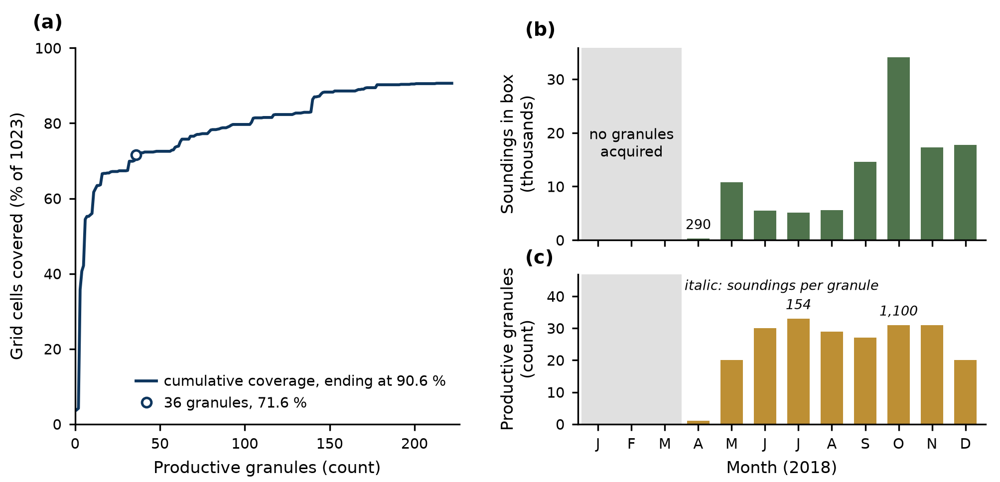
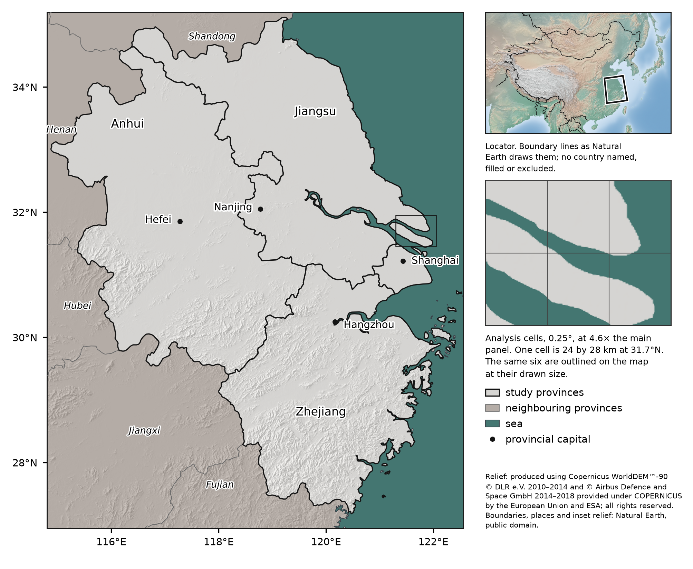
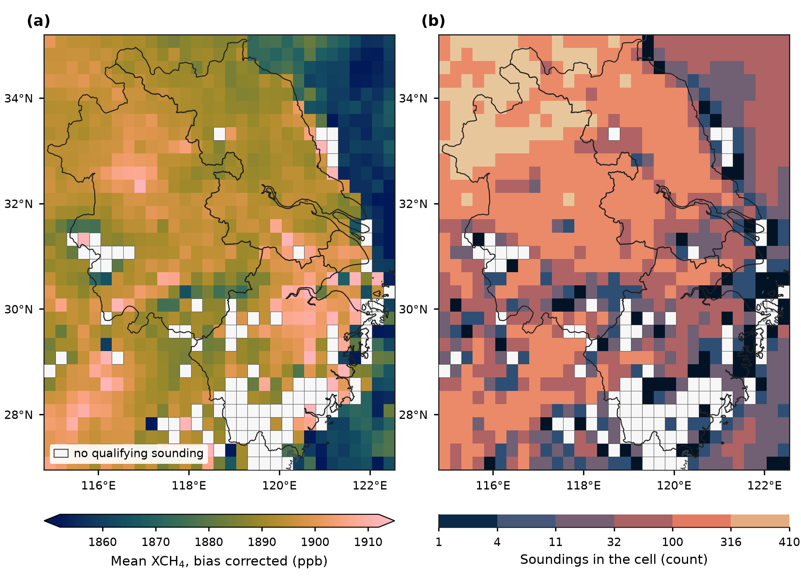

# Figure captions

Self-contained captions for the figures in this directory, in the form the
README uses. Each is written to be read without the surrounding text.

Figures are generated, not drawn by hand. Each is produced by a module under
`src/figures/` and written through the verified export path in
`src/figures/output.py`, which refuses to write anything below 300 dpi or
narrower than 8 cm. Regenerate with the script named under each caption.

---

### Coverage saturation and monthly yield, 2018

**Coverage of the analysis grid is a union statistic, so it saturates with the
number of granules that return data, and a small sample measures its own size
rather than the year's coverage.** Thirty-six productive granules reach 71.5
percent of the 1,023 cells and the remaining 187 add only 19.1 points to finish
at 90.52<!--#composite.coverage_percent--> percent. Soundings also arrive unevenly through the year, and the
unevenness runs opposite to the growing season: October alone carries 30.82
percent of the year's 110,920<!--#composite.soundings--> in-box soundings, while June, July and August
together carry 14.51 percent from three times as many granules.

Panel (a) is the cumulative count of grid cells that have received at least one
qualifying sounding, against productive granules in the order the streaming
loop handled them. Of 578<!--#composite.granules_gridded--> granules acquired over the box, 223<!--#composite.granules_with_data--> returned a
qualifying sounding and 355 returned none; a granule that returned none cannot
have covered a cell, so it is not a point on the axis. The curve is one
ordering of those 223 rather than an expected saturation curve, since a
different order reaches the same endpoint by a different path. The marked
sample size is the granule count of the 2018 reconnaissance, which reported
56.11 percent coverage; that figure is not a point on this curve, because those
thirty-six granules were drawn one per alternate month across seven years and
only six of them fall in 2018. Panels (b) and (c) share a month axis and are
stacked rather than drawn on twin axes, so neither series can be made to look
larger than the other by a choice of limits. January through March are shaded
because the reprocessed 2018 stream begins on 30 April; no granule was acquired
over the box in those months, which is a different fact from a month that was
sampled and yielded nothing. April is a single granule and 273 soundings,
labelled because at this scale its bar is otherwise indistinguishable from the
shaded absence beside it. Per-granule yield runs from 148 soundings in July to
1,103 in October, a factor of 7.4, and the July minimum coincides with both the
monsoon cloud cover that defeats the retrieval and the flooded-paddy season the
study is about. Coverage is computed on the 0.25 degree grid of 33 by 31 cells;
qualifying soundings are those with `qa_value` at or above 0.75.

Regenerate with `python scripts/make_coverage_figure.py`.

---

### Study area and analysis grid

**The four provinces of the Yangtze River Delta region, on the terrain that
explains where the methane composite has no data.** The analysis grid is 33
rows by 31 columns, 1,023<!--#composite.total_cells--> cells at 0.25 degrees,
spanning 114.8 to 122.55 east and 26.95 to 35.2 north. Those are the bounds the
cells actually occupy, not the declared box of 114.8 to 122.6 and 27.0 to 35.2:
the cell count rounds down in longitude and up in latitude, so the grid stops
0.05 degrees short of the declared east edge and runs 0.05 degrees past the
declared south edge.

The main panel is shaded relief from Copernicus DEM GLO-90 at 90 m, drawn over
all land in the frame and then veiled outside the four study provinces and
tinted inside them, so the study region is separated by tone as well as by its
heavier boundary and survives a print with no colour. The five provinces that
share the frame are named in italic; each is every admin-1 unit intersecting
the drawn extent, not a chosen list. Marked places are the four provincial
capitals, selected as Natural Earth's admin-1 capitals of the four study
provinces at scale rank 4 or better, which is the narrowest rule that returns
all four: Shanghai is rank 0, Nanjing and Hangzhou rank 2 and Hefei rank 4, and
a bare threshold reaching Hefei also reaches fourteen other places in the box.
Shanghai's name serves both the municipality and the city: at 8 pt the word
occupies 0.99 by 0.21 degrees here and no position inside the municipality's
polygon fits it, while the other three provinces each hold their name easily. The analysis lattice is **not** drawn
across the main panel, where 66 lines would be texture rather than reference and
where the composite figure already shows the resolution by drawing the cells as
the data; the detail box instead shows six cells over the Yangtze mouth at 4.6
times the main panel's scale, and the same six are outlined on the map at their
drawn size. One cell is 24 by 28 km at 31.7 north. The locator sits outside the
map frame rather than over Zhejiang's coast, and draws Natural Earth's admin-0
land boundary lines unfiltered, with no country named, filled or excluded; six
of the 59 lines in its extent are classed "Disputed (please verify)" by Natural
Earth itself, which also ships 33 per-country viewpoint fields, and this
repository takes no position on any of them.

The terrain is the finding, thin as a reference map's finding must be. The 97<!--#composite.uncovered_cells-->
cells of the lattice that received no qualifying sounding in 2018 are not
scattered evenly over it: 74<!--#composite.absent_on_land--> of them lie wholly
on land, and their median elevation is 502<!--#composite.absent_median_elevation-->
m against 35<!--#composite.covered_median_elevation--> m for the 926<!--#composite.covered_cells-->
cells that were observed. 50<!--#composite.absent_above_500m--> of the 97 sit
above 500 m, against 24<!--#composite.covered_above_500m--> of the 926. The
largest connected group, 47<!--#composite.largest_absent_block--> cells of the
19<!--#composite.absent_components--> the absent cells form, covers the
mountains along the southern edge of the box, 35 of its 47 cells falling mostly
in Zhejiang and 11 in Fujian, at a median 552 m and reaching 1,119 m. That block
is the darkest terrain in this panel, and it is the hole in the middle of the
composite figure's southern edge. Which cells those are is the composite
figure's subject and is deliberately not drawn here.

Boundaries, coastline, populated places and the inset relief are Natural Earth
and are public domain; the province and land layers are 10 m and the inset
boundaries 50 m. Shanghai's outline is the one caveat worth naming at this size:
Natural Earth resolves the municipality with 213 vertices across four parts
where GADM 4.1 uses 1,925 across 112, and at 1.5 cm of drawn width the
difference is not visible, appearing as straight segments along the coast only
above roughly three times magnification. Shaded relief is derived data and its
licence requires the notice carried on the figure: produced using Copernicus
WorldDEM™-90 © DLR e.V. 2010–2014 and © Airbus Defence and Space GmbH 2014–2018
provided under COPERNICUS by the European Union and ESA; all rights reserved.
The organisations in charge of the Copernicus programme by law or by delegation
do not incur any liability for any use of the Copernicus WorldDEM™-90. The main
map is equirectangular with its standard parallel at 31.075 north, the centre of
the study area, so a degree of longitude is drawn 0.857 times as long as a
degree of latitude and the analysis cells stay rectangular; scale is exact only
at that parallel, running 3.9 percent small at the southern edge and 4.8 percent
large at the northern, and area is not preserved. Nothing in this study is
measured from a map, since areas are computed analytically on the authalic
sphere, so the projection is a display choice throughout. The locator is drawn
in the China Albers equal-area conic, which is why the study box appears rotated
in it.

Regenerate with `python scripts/make_study_area_figure.py`. The relief and place
layers it reads are built once by `python scripts/build_map_reference.py --write`
from tiles fetched by `python scripts/fetch_copernicus_dem.py --download`.

---

### The 2018 methane composite

**The methane field is smooth at the scale of the analysis lattice, and 9.5<!--#composite.uncovered_percent-->
percent of the lattice is not observed at all.** Cell means run from 1,840 to
1,947 ppb, but the middle 96 percent of them span only 59 ppb, and neighbouring
cells rarely differ by more than a few. The unobserved part is not scattered
noise: 97<!--#composite.uncovered_cells--> of the 1,023<!--#composite.total_cells--> cells
carry no qualifying sounding, and they fall into 19<!--#composite.absent_components-->
connected groups of which the largest holds 47<!--#composite.largest_absent_block-->
cells over mountainous southern Zhejiang. Where the field is observed it rests
on very unequal evidence, from 1<!--#composite.min_soundings--> sounding to
410<!--#composite.max_soundings--> with a median of 74<!--#composite.median_soundings-->.

Panel (a) is the mean of the bias-corrected retrieval, which is the
operationally corrected product and the variable the reproduction's analysis
used throughout; it is not interchangeable with the raw retrieval, since the
correction averages +11.64<!--#composite.bias_mean--> ppb and varies across
cells by more than the field's own standard deviation. The correction does not
remove the field's dependence on surface albedo, which is 199.7<!--#albedo.slope_corrected-->
ppb per unit albedo after correction against 203.9<!--#albedo.slope_raw--> before.
The scale is clipped to the middle 96 percent of cell means, with the arrow caps
marking values beyond it; the excluded tails sit in the least-sampled cells,
whose median count is 2 soundings at the high end and 12 at the low against
74 overall, so they are thin sampling rather than methane. Panel (b) is the
number of qualifying soundings each cell mean rests on, classed in half-decade
steps rather than shaded continuously, because a linear scale would render
every sparse cell alike and the sparse cells are where the sampling structure
is. Both panels share one frame and one lattice of 33 by 31 cells at 0.25
degrees, so a cell in one is the same cell in the other. Coverage is
90.52<!--#composite.coverage_percent--> percent of the lattice over
110,920<!--#composite.soundings--> in-box soundings; qualifying means a
`qa_value` at or above 0.75. Boundaries and coastline are Natural Earth.

Regenerate with `python scripts/make_composite_figure.py`.
